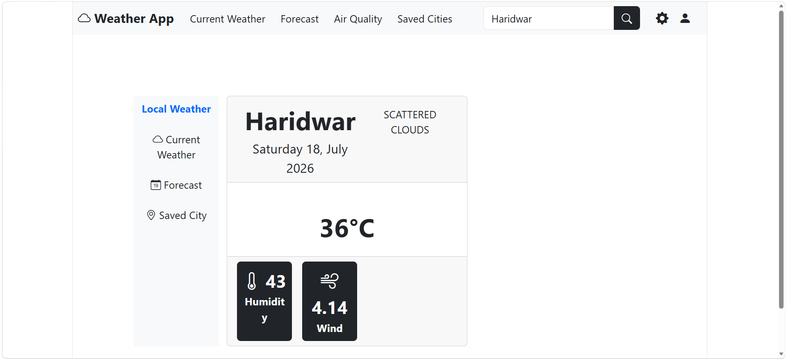

# 🌦️ Weather App

A responsive Weather Application built with **React.js**, **Axios**, **Bootstrap**, and the **OpenWeatherMap API**. Users can search for any city and view real-time weather information, including temperature, humidity, wind speed, and current weather conditions.

---

## ✨ Features

- 🔍 Search weather by city name
- 🌡️ Real-time temperature in Celsius
- 💧 Humidity information
- 🌬️ Wind speed details
- 📅 Current date display
- ☁️ Weather description
- 📱 Fully responsive design

---

## 🛠️ Technologies Used

- React.js
- Axios
- Bootstrap
- Moment.js
- OpenWeatherMap API

---

## 🚀 Installation

```bash
npm install
npm run dev
```

---

## 📷 Screenshot

> Add a screenshot of your application here.

Example:



---

## 📂 Project Structure

```
Weather-App/
│
├── public/
│
├── src/
│   ├── Components/
│   │   └── Weather.jsx
│   ├── App.jsx
│   ├── main.jsx
│   └── index.css
│
├── .gitignore
├── index.html
├── package-lock.json
├── package.json
├── vite.config.js
├── README.md
```

---

## 👨‍💻 Author

**Yoginand Digambar Bhokare**

- 📧 Email: yoginandb@gmail.com
- 💼 LinkedIn: www.linkedin.com/in/yoginand-bhokare-725b51275 
- 💻 GitHub: https://github.com/yogibhokare18 

---

⭐ If you like this project, don't forget to give it a Star!
